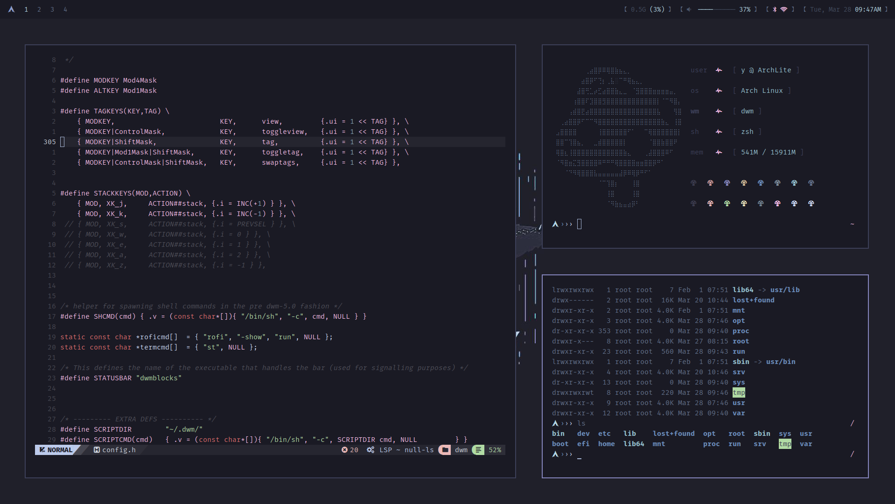

  <h1> Succless </h1>
  <a href="https://suckless.org/">Suckless</a> good
  Currently using <a href="https://github.com/FrenzyExists/aquarium-vim">Aquarium</a> scheme.

 

  

    
  

 

## Contents
- dwm - fully patched [dwm-flexipatch](https://github.com/bakkeby/dwm-flexipatch) with a few additional features for the looks.
- st - patched simple terminal.
- dwmblocks - [dwmblocks-async](https://github.com/UtkarshVerma/dwmblocks-async) by UtkarshVerma.

## Credits
Thanks to [Luke Smith](https://github.com/LukeSmithxyz) ofc.

